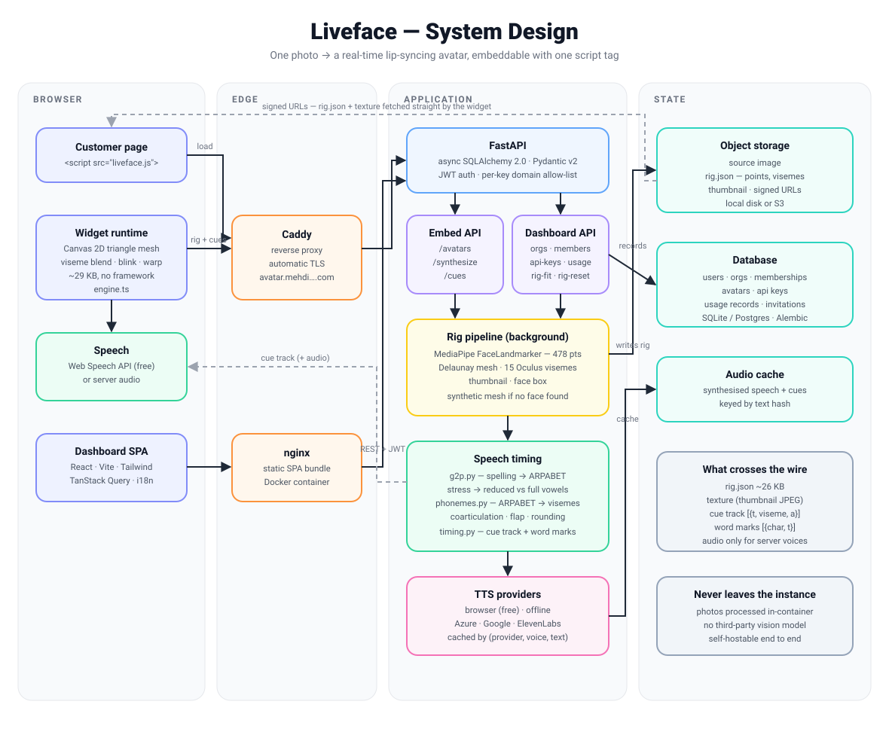

# Liveface — System Design

Liveface turns a single photograph into a real-time, lip-syncing talking avatar
that can be embedded on any web page with one `<script>` tag.



---

## The shape of the system

Four lanes, left to right: what runs in the visitor's browser, what terminates
the connection, what runs the application, and what holds state.

The important structural decision is that **the widget is not a video player**.
Nothing streams. The browser downloads a small mesh description once, then does
all the animation locally against a still image. What travels per utterance is
a list of mouth shapes and timestamps — a few hundred bytes — not frames.

### 1. Browser

| Piece | What it does |
|---|---|
| **Customer page** | Any site. One `<script>` tag with `data-avatar` and `data-key`. |
| **Widget runtime** | ~29 KB, no framework. Warps the photo with a Canvas 2D triangle mesh, blends visemes, blinks, breathes. |
| **Speech** | The free Web Speech API by default; server-synthesised audio when a paid voice is configured. |
| **Dashboard SPA** | React + Vite + Tailwind, TanStack Query, i18n (en/fr, RTL-ready). Separate from the widget. |

### 2. Edge

Caddy terminates TLS and routes `/api/*` to the backend and everything else to
the static SPA. Certificates renew themselves. Both app containers sit on an
internal Docker network and are never exposed directly.

### 3. Application

FastAPI, async throughout.

- **Embed API** — what the widget talks to, authenticated by API key with a
  per-key domain allow-list. `/cues` is deliberately unauthenticated: it
  synthesises nothing and costs a text scan.
- **Dashboard API** — orgs, members, keys, usage, and the manual rig-fitting
  endpoints, authenticated by JWT.
- **Rig pipeline** — runs in the background on upload. MediaPipe
  FaceLandmarker finds 478 points, from which the service builds a Delaunay
  mesh, a 15-viseme blendshape set, a face box and a thumbnail. If no face is
  found it falls back to a synthetic mesh rather than failing the upload.
- **Speech timing** — the part that makes the lip-sync worth having, below.
- **TTS providers** — a common interface over browser, offline, Azure, Google
  and ElevenLabs. Results are cached by `(provider, voice, locale, text)`.

### 4. State

Object storage holds the source image, `rig.json` and the thumbnail, handed to
the browser as signed URLs so the API never proxies bytes. The database holds
accounts, avatars, keys and usage. Both are pluggable — local disk and SQLite
for a single box, S3 and Postgres when you outgrow it.

---

## How a request actually flows

**Creating an avatar**

1. The dashboard uploads a portrait; the API stores it and returns immediately
   with `status: processing`.
2. A background task detects landmarks, builds the rig, writes `rig.json` and a
   thumbnail, and flips the avatar to `ready`.
3. If detection put the landmarks in the wrong place — common on stylized art,
   because MediaPipe fits a *human* template — the user can mark the face by
   hand and **test before saving**. The preview and the saved result come from
   the same call with one flag flipped, so they cannot disagree.

**Speaking**

1. The page calls `Liveface.speak("…")`.
2. The text is converted to phonemes, then to a cue track: `[{t, viseme, a}]`,
   plus per-word character offsets.
3. With a browser voice, the widget speaks locally and drives the mouth from
   the cue track, resyncing on each `onboundary` event. With a server voice,
   the API returns audio and cues together, timed against the real duration.
4. The engine blends between cues and warps the mesh at 60fps.

---

## Why the lip-sync is not a mouth on a timer

This is the part that took the most work, and the part most competitors skip.

**Pronunciation, not spelling.** Text is converted to ARPABET phonemes before
it reaches the face. Driven by letters, "the" is three unrelated shapes for a
two-sound word and "knight" mimes a hard k. Driven by phonemes it is `DH AH`
and `N AY T`. Measured, this cut mouth-shape changes from ~10.8/sec to
~8.8/sec — inside the 7–12/sec range of real speech, where the letter-driven
version sat at the top of it.

**Stress.** English reduces unstressed syllables, and a reduced vowel is a
small mouth. Without it a face gapes equally on every syllable. Stressed-to-
unstressed contrast measures 8.2× against 2.7× before.

**Coarticulation.** Mouth shapes overlap rather than snapping between
keyframes: each cue contributes on a flat-topped bell, so the shape at any
instant mixes what the mouth just did, is doing, and is about to do. That is
also why /k/ differs in "key" and "coo". Measured, ~30% less jaw jerk with
*more* range, not less.

**Closure as a constraint.** A blend is an average, so it can never reach a
single viseme's peak. Left alone, /p/ /b/ /m/ closure collapsed to 0.37 of
target — the mouth never actually shut. Those shapes are re-asserted after
blending, which brings closure back to 0.88 without adding jerk.

**Frame-rate independence.** Damping is an exponential filter over real elapsed
time, not a fixed fraction per frame. The earlier version ran the mouth at
roughly half speed on a 30fps device.

---

## Tech stack

```
FRONTEND (dashboard)
  React 18 · TypeScript · Vite · Tailwind CSS
  TanStack Query          server state, polling, cache invalidation
  React Router            routing, protected + guest-only routes
  react-hook-form + zod   forms and validation
  react-i18next           en / fr, RTL-ready via logical properties

EMBED WIDGET
  TypeScript · esbuild → single IIFE bundle (~29 KB, no framework)
  Canvas 2D               triangle-mesh warp, Cramer's-rule affine solve
  Web Speech API          free local voices + speech recognition
  Three.js (optional)     separate 3D bundle for GLB avatars

BACKEND
  Python 3.12 · FastAPI · Uvicorn
  SQLAlchemy 2.0 (async) · Alembic
  Pydantic v2 · pydantic-settings
  MediaPipe FaceLandmarker    478 landmarks + 52 ARKit blendshapes
  Pillow · numpy              image handling, mesh maths
  passlib · python-jose       password hashing, JWT
  pytest + pytest-asyncio     230 tests

SPEECH
  Custom G2P              dependency-free English grapheme → phoneme
                          (CMUdict is ~3.5 MB; this ships in the container)
  ARPABET → 15 Oculus visemes with coarticulation rules
  Phoneme-duration timing model shared by every provider
  Providers: browser · offline · Azure · Google · ElevenLabs

DATA
  SQLite (single box) or PostgreSQL
  Local disk or S3-compatible object storage, signed URLs

INFRASTRUCTURE
  Docker · docker compose · multi-stage builds
  Caddy                   reverse proxy, automatic TLS
  nginx                   static SPA
  Deployed at avatar.mehdisadeghian.com
```

---

## Deliberate trade-offs

**A mesh warp, not a neural video model.** Diffusion-based talking heads look
better and cost a GPU per stream, several seconds of latency, and sending the
customer's photograph to a third party. This runs at 60fps on a phone, starts
instantly, and the photo never leaves the instance. The ceiling is lower and
the floor is much higher.

**Timing on the server, rendering on the client.** The phoneme model is one
implementation used by every voice, so a free browser voice gets the same
timing quality as a paid one. The client only interpolates.

**Signed URLs instead of proxying.** `rig.json` and the texture are fetched
straight from storage. The API stays small and stateless.

**Effects stand down rather than guess.** Where the source cannot support an
effect, it is not drawn: the iris is not repainted when it is under 14 texture
pixels, and the mouth interior colour is derived from the face's own lips
instead of a hardcoded near-black. Losing an effect is invisible; a grey disc
over an eye is not.

---

## What is not built yet

- Redis and a real job queue — rig building is a FastAPI background task, which
  is fine for one box and not for many.
- Horizontal scale: sessions are stateless, but the local-disk storage backend
  has to become S3 before a second API replica makes sense.
- Server-side neural TTS (Piper/Kokoro) for good voices without a per-call bill.
- Conversation mode: speech-to-text → LLM → speech, with the avatar as the face.
